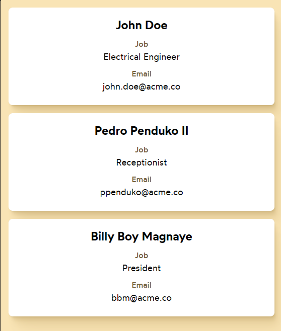

# Exercise: Components

> In running this exercise make sure that nodejs is installed on your local machine ([How to install nodejs](https://nodejs.org/en/learn/getting-started/how-to-install-nodejs))
>
> In this current directory please run `npm install`
> To test run `npm run dev`
>
> Usually the application will be accessible in your browser in http://127.0.0.1:5173/ or http://localhost:5173/

## Instructions:

The UI should match the screenshot.

- Create a new component, ContactCard, and use that component for each of the 3 contacts.
- Props should be created for any bits of information that vary from card to card.

#### Reference:

https://courses.joshwcomeau.com/joy-of-react/01-fundamentals/03.05-component-exercises
